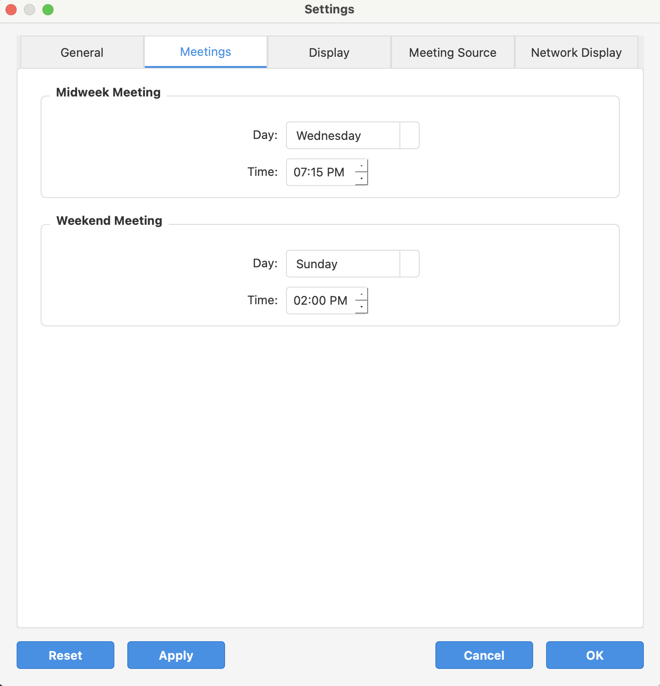
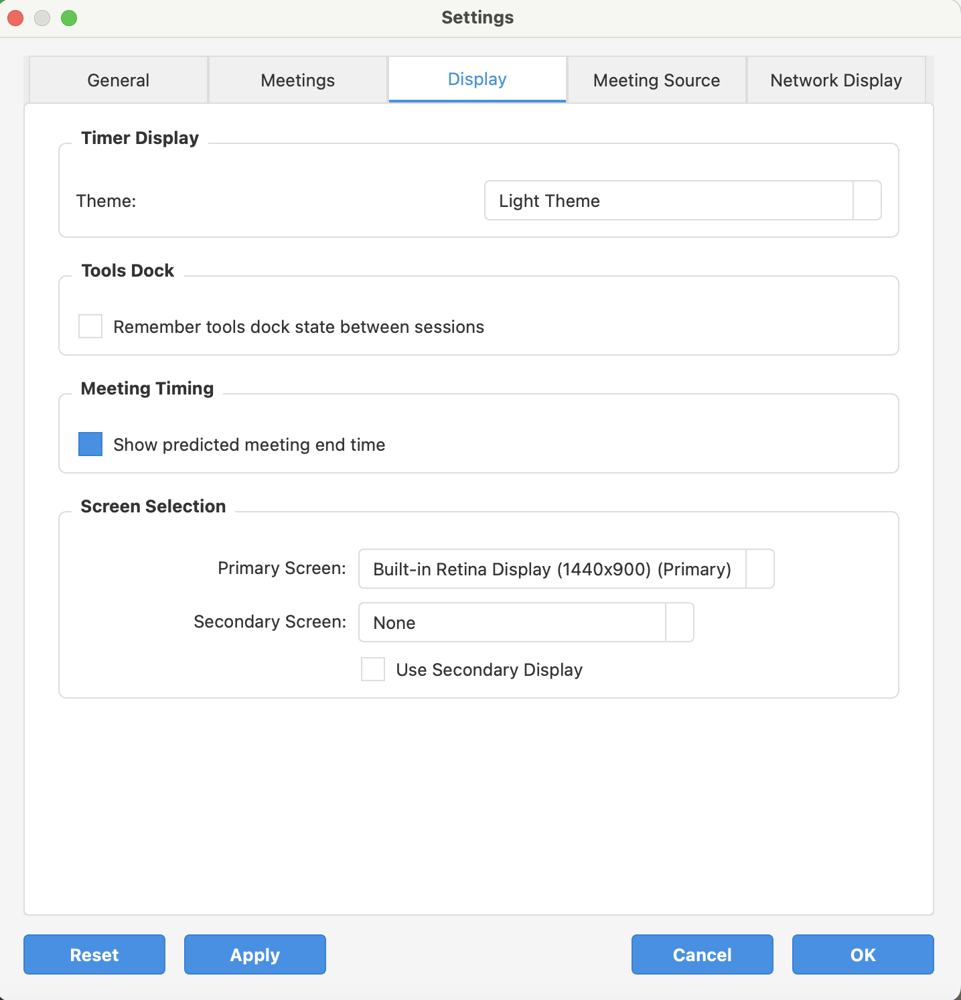
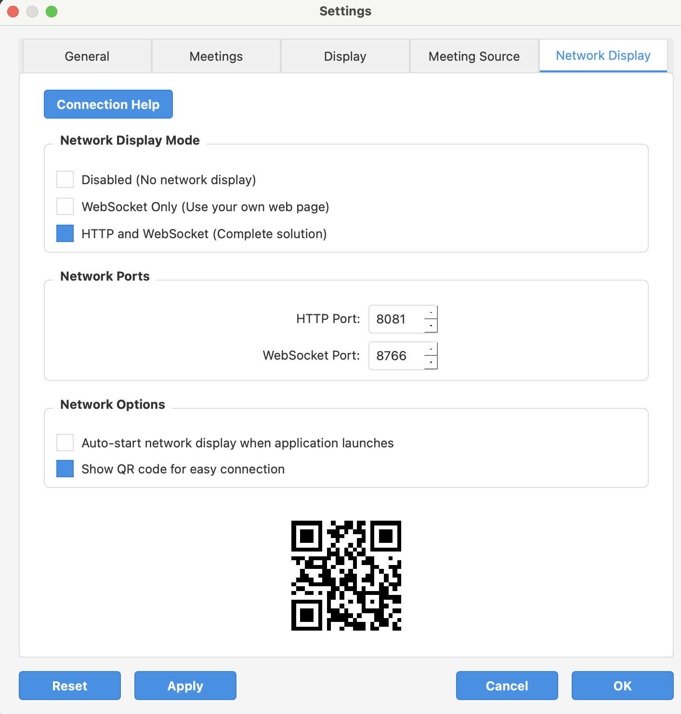

# OnTime Meeting Timer - Quick Start Guide 🚀

** 🖥️ Main Interface Overview**  
The top toolbar includes:  
- ⏯️ **Start Meeting** (green) and **Pause** (orange) buttons  
- ◀️ **Previous** / ▶️ **Next** section navigation  
- ➖1 / ➕1 Minute adjustment controls  
- 📋 Meeting selection dropdown  
- ⚙️ **Settings** button for quick access  

Below the toolbar, the large clock shows remaining time in HH:MM:SS. Underneath, the agenda table lists sections, durations, and status. The footer displays the **Next Part** and **Secondary Display** status.

---

## 1. Configuring Meetings 📝

1. Click ⚙️ **Settings** in the top toolbar and select the **Meetings** tab.  
2. Under **Midweek Meeting**, set your meeting **Day** and **Time**.  
3. Under **Weekend Meeting**, set your meeting **Day** and **Time**.  
4. Click ✅ **Apply** to save.

## 2. Configuring Displays 💻 🖥️

1. In ⚙️ **Settings**, go to the **Display** tab.  
2. Under **Timer Display**, choose your theme (🌞 Light or 🌚 Dark).  
3. In **Screen Selection**, pick:  
   - 💻 **Primary Screen** for your main timer  
   - 🖥️ **Secondary Screen** for external display  
4. Check ✅ **Use Secondary Display** to enable the timer on both screens.  
5. (Optional) Check ⏳ **Show predicted meeting end time**.  
6. Click ✅ **Apply**.

## 3. Configuring Meeting Sources 🔗

1. In ⚙️ **Settings**, open the **Meeting Source** tab.  
2. Select one mode:  
   - 🌐 **Web Scraping**: download from wol.jw.org  (recommended)
   - 📄 **Template-Based**: load from saved templates  
   - ✍️ **Manual Entry**: enter all parts manually  
3. Optionally enable:  
   - 🔄 **Automatically update meetings from the web**  (recommended)
   - 💾 **Save scraped meetings as templates**  
   - 🎵 **Always manually enter weekend songs**  if you prefer to always enter the opening song for weekend meetings
4. Click ✅ **Apply**.

## 4. Configuring Network Display 🌐

1. In ⚙️ **Settings**, switch to the **Network Display** tab.  
2. Set **Network Display Mode** to 🔗 **HTTP and WebSocket (Complete solution)**.  
3. **Recommended:** Check ✅ **Auto-start network display when application launches**.  
4. (Optional) Check 📱 **Show QR code for easy connection**.  
5. Click ✅ **Apply**.

## 5. Using the Timer During Meetings ⏱️

1. Click ▶️ **Start Meeting** (green).  
2. Use ⏸️ **Pause**, ◀️ **Previous**/▶️ **Next**, and ➖1/➕1 **Minute** to control flow.  
3. Read the large timer (HH:MM:SS) for remaining time.  
4. Watch the agenda table for part statuses.  
5. View the **Next Part** in the footer.  
6. Click ⏹️ **Stop** or let the timer finish to end.

## Secondary Display 🖥️

The secondary screen shows a full‑screen countdown with large digits, the upcoming part, and predicted end time (if enabled).

---

> **Note for macOS users:**  
> After installing the `.dmg`, you may see a security warning because the app isn’t notarized by Apple. If the application is blocked, open **System Settings → Privacy & Security** and click **Open Anyway** next to OnTime Meeting Timer.  
> For more information, see [Apple’s support article](https://support.apple.com/en-gb/guide/mac-help/mh40617/mac).

For detailed documentation, visit the [readme document](https://github.com/berba-q/meeting_timer).

To request for new features or to report potential bugs, please use the [issues feature](https://github.com/berba-q/meeting_timer/issues/new/choose)