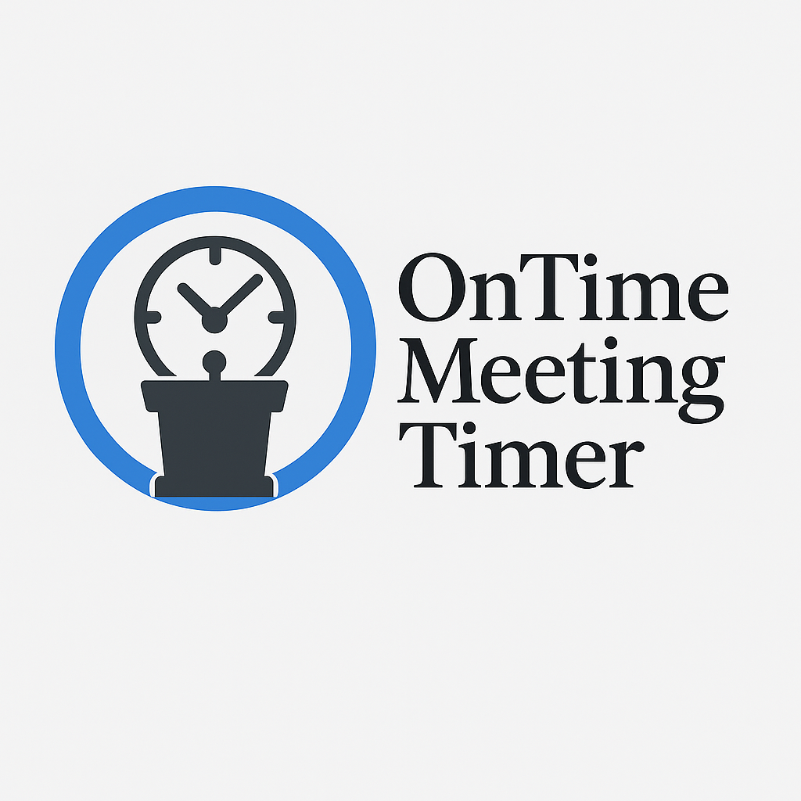
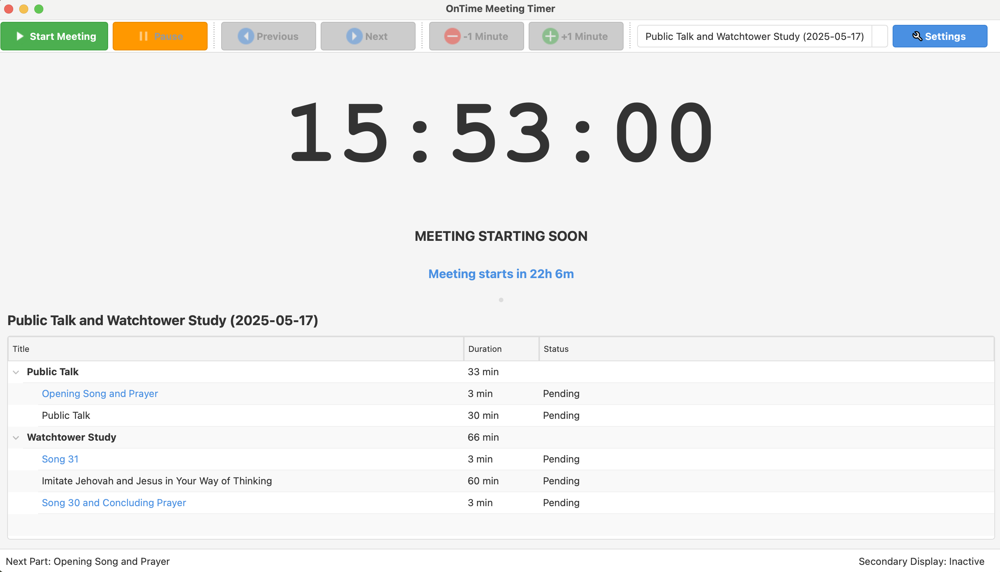
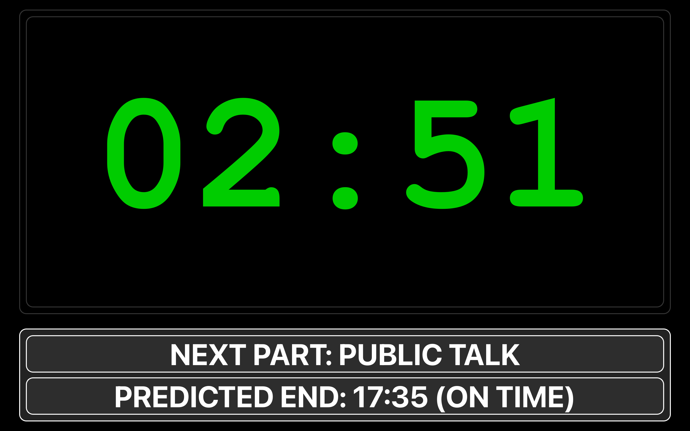
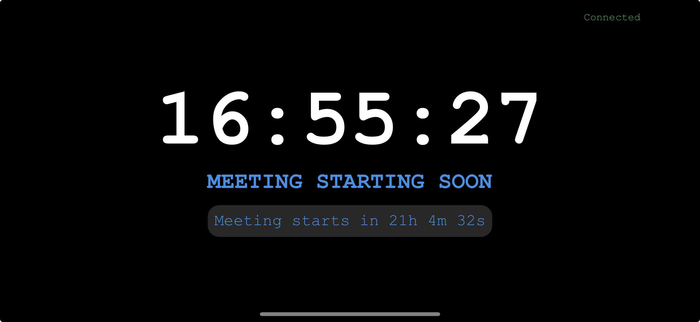

# OnTime Meeting Timer

A cross-platform timer application designed specifically for managing meeting schedules with robust timing, display options, and network sharing capabilities.

## Features

### Meeting Management
- **Meeting Templates**: Support for midweek, weekend, and custom meeting formats
- **Automatic Meeting Updates**: Can scrape current meeting schedules from wol.jw.org
- **Manual Customization**: Edit all meeting parts, durations, and presenters on the fly
- **Weekend Song Editor**: Specialized interface for managing weekend meeting songs
- **Flexible Meeting Creation**: Create meetings from templates or from scratch

### Timer Functions
- **Intuitive Timer Controls**: Start, pause, stop, next part, previous part
- **Time Adjustment**: Add or subtract minutes on the fly
- **Part Navigation**: Jump to any part in the meeting
- **Overtime Tracking**: Automatic tracking of overtime for individual parts and the entire meeting
- **Predicted End Time**: Real-time calculation of expected meeting end time based on current progress
- **Chairman Transitions**: Special transition mode between parts with automatic timing

### Display Options
- **Multi-Screen Support**: Configure primary and secondary displays
- **Secondary Display**: Full-screen display optimized for speakers/audience
- **High-Contrast Display**: Ensures visibility from a distance
- **Theme Options**: Light and dark themes available
- **Font Sizing**: Automatic adjustment for optimal visibility at any window size

### Network Display
- **Browser-Based Remote Display**: Share timer on any device with a web browser
- **Multiple Connection Methods**:
  - Built-in web server provides a complete solution
  - WebSocket-only option for custom displays
- **QR Code Connection**: Easily connect mobile devices by scanning QR code
- **Auto-Start Option**: Network display can start automatically with the application
- **Multiple Connected Devices**: Support for multiple viewers on different devices

### Cross-Platform
- Works on Windows, macOS, and Linux
- Consistent interface across platforms
- No external dependencies required

## Screenshots

### Main Interface

### Secondary Display

### Mobile Network Display

## Getting Started

### Download
Download the latest release for your platform:
- [Windows Installer (.exe)](https://github.com/berba-q/meeting_timer/releases)
- [macOS App (.dmg)](https://github.com/berba-q/meeting_timer/releases)
- [Linux AppImage (.AppImage)](https://github.com/berba-q/meeting_timer/releases)

### Installation

#### Windows
1. Run the downloaded installer (OnTimeSetup.exe)
2. Follow the installation prompts
3. Launch OnTime from the Start menu or desktop shortcut

#### macOS
1. Open the downloaded DMG file
2. Drag OnTime to your Applications folder
3. Launch from Applications or the Dock

> **Note for macOS users:**  
> After installing the `.dmg`, you may see a security warning because the app isn’t notarized by Apple. If the application is blocked, open **System Settings → Privacy & Security** and click **Open Anyway** next to OnTime Meeting Timer.  
> For more information, see [Apple’s support article](https://support.apple.com/en-gb/guide/mac-help/mh40617/mac).

#### Linux
1. Make the AppImage executable: `chmod +x OnTime.AppImage`
2. Run the AppImage: `./OnTime.AppImage`

### First Use Guide

1. **Launch the application**
2. **Select or create a meeting**:
   - Use the dropdown in the toolbar to select a meeting
   - Or create a new meeting via File > New Meeting
3. **Start the timer**:
   - Click "Start Meeting" to begin
   - Use the control buttons to navigate through parts
4. **Set up secondary display** (optional):
   - Go to Settings > Display
   - Configure your secondary screen
   - Toggle the secondary display with F10 or view menu

## Using the Network Display

1. **Enable network display**:
   - Go to Settings > Network Display
   - Choose "HTTP and WebSocket" mode
   - Configure ports if needed
   
2. **Start the network display**:
   - Click "Start" on the Network panel in the tools dock
   - Or use View > Network Display > Start Network Display
   
3. **Connect devices**:
   - Ensure all devices are on the same network
   - Open a web browser on client device
   - Enter the URL shown in the Network panel
   - Or scan the QR code if enabled

## Advanced Features

### Meeting Management
- **Web Scraping**: Automatically get meeting schedules from wol.jw.org
- **Template-Based Meetings**: Create meetings from templates with customizations
- **Meeting Editor**: Full editor for all meeting details
- **Weekend Song Handling**: Special support for weekend songs with dedicated editor

### Display Configuration
- **Precision Screen Selection**: Choose which specific screens to use for main and secondary displays
- **Theme Selection**: Choose between light and dark themes
- **Tools Dock**: Toggle and remember state of tools dock for more workspace

### Timer Control
- **Part Navigation**: Double-click any part to jump directly to it
- **Contextual Controls**: Right-click menu for part-specific operations
- **Time Adjustment**: Add or remove minutes with a click

## Troubleshooting

### Network Display Issues
- Ensure all devices are on the same network
- Check if any firewalls are blocking the configured ports
- Try restarting the network display service

### Secondary Display Issues
- If the secondary display appears on the wrong screen, check Settings > Display
- Restart the application after connecting new displays
- Ensure your graphics drivers are updated

### Meeting Data Issues
- If web scraping fails, try manual creation or template-based meetings
- Reset settings in Settings dialog if needed

## Contributing

OnTime Meeting Timer is an open-source application. Contributions are welcome!

- Report bugs or suggest features via [GitHub Issues](https://github.com/berba-q/meeting_timer/issues/new/choose)
- Submit pull requests via [GitHub](https://github.com/berba-q/meeting_timer/pulls)

## License

OnTime Meeting Timer is released under the MIT License. See [LICENSE](https://github.com/berba-q/meeting_timer?tab=MIT-1-ov-file#readme) for details.

## Acknowledgments
Special thanks to `Michael Mena`, `Antonio Montaperto` and `Clayton Smith` for their kind contributions to this project ⭐⭐⭐⭐⭐!

- Built with 🐍 Python and a tiny bit of HTML 🕸️ and Javascript 🕸️
- Special thanks to all contributors and testers
